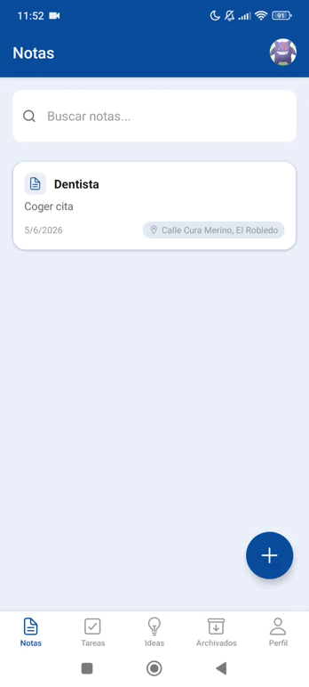
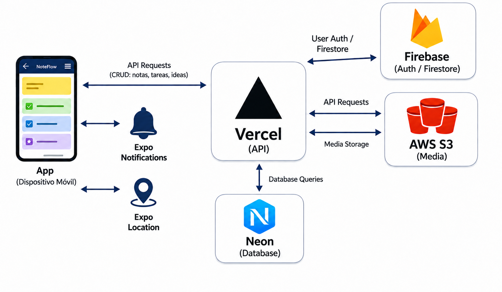

# NoteFlow — Mobile & Web App

[](https://github.com/Josele97-dev/noteflow/actions/workflows/test.yml)

Aplicación multiplataforma para gestión de notas, tareas e ideas, construida con Expo, React Native y un backend moderno en Next.js, con sincronización en la nube, notificaciones push, geolocalización y almacenamiento multimedia en AWS. Disponible en Android y web.

---

## Demo rápida (GIF)

<p align="center">
  
</p>

---

## Demo técnica en Loom

https://www.loom.com/share/559b0b51cdb545b0aa1386e5614d9e7b

---

## Estructura del proyecto

```bash
noteflow/
│
├── .expo/
├── .github/
│   └── workflows/
│       └── test.yml
├── app/
│   ├── (auth)/
│   │   ├── _layout.tsx
│   │   ├── login.tsx
│   │   └── register.tsx
│   ├── (tabs)/
│   │   ├── _layout.tsx
│   │   ├── archivados.tsx
│   │   ├── checklists.tsx
│   │   ├── ideas.tsx
│   │   ├── notas.tsx
│   │   └── perfil.tsx
│   ├── checklists/
│   │   ├── editar/
│   │   │   └── EditTaskScreen.tsx
│   │   └── [id].tsx
│   ├── ideas/
│   │   ├── editar/
│   │   │   └── EditIdeaScreen.tsx
│   │   └── [id].tsx
│   ├── notas/
│   │   ├── editar/
│   │   │   └── EditNoteScreen.tsx
│   │   ├── [id].tsx
│   ├── _layout.tsx
│   ├── crear.tsx
│   ├── index.tsx
│   └── assets/
│       ├── adaptive-icon.png
│       ├── favicon.png
│       ├── icon.png
│       ├── notification-icon.png
│       └── splash-icon.png
│
├── components/
│   ├── animations/
│   │   ├── FadeInDown.tsx
│   │   └── FadeOutLeft.tsx
│   ├── archived/
│   │   └── ArchivedSection.tsx
│   ├── items/
│   │   ├── ChecklistCard.tsx
│   │   ├── IdeaCard.tsx
│   │   ├── ItemActions.tsx
│   │   └── NoteCard.tsx
│   ├── lists/
│   │   └── BaseList.tsx
│   └── ui/
│       ├── DateTimePicker.tsx
│       └── EditHeader.tsx
│
├── constants/
│   └── theme.ts
│
├── docs/
│   ├── arquitectura/
│   │   └── Diagrama.png
│   ├── Demo/
│   │   └── Demo.gif
│   ├── adr.md
│   ├── ai-setup.md
│   ├── idea.md
│   ├── project-management.md
│   └── react-native-teoria.md
│
├── hooks/
│   ├── use-color-scheme.ts
│   ├── use-color-scheme.web.ts
│   ├── use-theme-color.ts
│   └── useExitAnimation.ts
│
├── lib/
│   ├── api.ts
│   └── firebase.ts
│
├── store/
│   └── notesStore.ts
│
├── tests/
│   ├── screens/
│   │   ├── checklists.test.tsx
│   │   ├── ideas.test.tsx
│   │   └── notas.test.tsx
│   └── store/
│       └── notesStore.test.ts
│
├── types/
│   └── index.ts
│
├── utils/
│   └── ideaColors.ts
│
├── .gitignore
├── app.json
├── babel.config.js
├── eas.json
├── eslint.config.js
├── expo-env.d.ts
├── google-services.json
├── jest.config.js
├── package-lock.json
├── package.json
├── README.md
└── tsconfig.json
```

---

## Arquitectura

NoteFlow sigue una arquitectura cliente-servidor donde la aplicación actúa como capa de presentación y delega toda la lógica de negocio, la persistencia de datos y el acceso a servicios externos en componentes especializados.

### App (Android y Web)

La aplicación está desarrollada con Expo y React Native, y constituye el punto de entrada principal para los usuarios tanto en Android como en navegador web. Las funcionalidades dependientes del dispositivo (notificaciones y geolocalización) están condicionadas por plataforma mediante guards de `Platform.OS`.

### Vercel (API)

La API serverless desplegada en Vercel actúa como núcleo central de la arquitectura. Recibe todas las peticiones, valida la autenticación y coordina la comunicación con el resto de servicios. Incluye configuración CORS para permitir peticiones desde la versión web.

### Firebase (Auth / Firestore)

Firebase se utiliza para la autenticación de usuarios y para almacenar información básica de perfil. Se usa el SDK web de Firebase (`firebase/auth`, `firebase/firestore`) tanto en móvil como en web, con persistencia de sesión configurada mediante AsyncStorage en Android e indexedDB en web. Las claves de Firebase se gestionan mediante variables de entorno (.env) y no se incluyen en el repositorio.

### Neon (Database)

Neon proporciona una base de datos PostgreSQL serverless donde se almacena todo el contenido principal de la aplicación, incluyendo notas, checklists, ideas, etiquetas y ubicaciones.

### AWS S3 (Media)

AWS S3 se encarga del almacenamiento de archivos multimedia, incluyendo imágenes de perfil. La API de Vercel gestiona la subida y recuperación mediante URLs firmadas.

### Expo Notifications

Gestiona las notificaciones locales del dispositivo. Solo disponible en móvil — en web se omite el flujo de recordatorio automáticamente.

### Expo Location

Permite acceder a los servicios de geolocalización. Solo disponible en móvil. La ubicación se captura al guardar una entrada y se persiste en PostgreSQL.

### Diagrama de arquitectura



### Infraestructura utilizada

| Componente                | Tecnología                 | Despliegue         |
| ------------------------- | -------------------------- | ------------------ |
| App Movil                 | Expo / React Native        | EAS / Play Store   |
| App Web                   | Expo Web                   | localhost / deploy |
| Backend API               | Next.js 16                 | Vercel             |
| Base de datos             | PostgreSQL                 | Neon               |
| Autenticacion             | Firebase Auth (SDK web)    | Firebase           |
| Perfil de usuario         | Firestore (SDK web)        | Firebase           |
| Almacenamiento multimedia | AWS S3                     | AWS                |
| Notificaciones push       | Expo Notifications (movil) | Expo               |
| Geolocalizacion           | Expo Location (movil)      | Expo               |

---

## Descripcion general

NoteFlow organiza la información en tres tipos de contenido:

- Notas — texto libre con edición completa.
- Checklists — listas de tareas con progreso.
- Ideas — notas rápidas con color, etiquetas y descripción.

Cada tipo tiene su propio flujo de creación, edición, archivado y visualización. Los datos se sincronizan con un backend real y cada usuario accede únicamente a su información, desde cualquier plataforma.

---

## Caracteristicas principales

### Autenticacion

- Registro e inicio de sesión con Firebase Auth (SDK web).
- Sesión persistente en móvil (AsyncStorage) y web (indexedDB).
- Perfil con nombre, email y foto.
- Foto de perfil almacenada en AWS S3.

### Notas

- Título, contenido y fecha.
- Vista de detalle.
- Edición completa.
- Archivado y eliminación con confirmación.
- Feedback háptico (móvil).

### Checklists

- Items marcables.
- Barra de progreso.
- Edición de listas e items.
- Archivado.
- Vibración al completar tareas (móvil).

### Ideas

- Etiquetas dinámicas.
- Color personalizado.
- Edición completa.
- Archivado.
- Organización visual rápida.

### Notificaciones locales (movil)

- Recordatorios programables al crear cualquier entrada.
- DateTimePicker custom sin dependencias nativas.
- Funciona incluso con la app cerrada.
- En web se omite el flujo de recordatorio automáticamente.

### Geolocalizacion (movil)

- Captura automática de ubicación al crear una entrada.
- Dirección persistente en base de datos.
- Chip de ubicación en cada detalle.

### Soporte web

- Versión web completamente funcional desde el navegador.
- Mismo usuario y datos compartidos entre móvil y web.
- Tema claro y oscuro según preferencia del sistema.
- Sombras adaptadas con boxShadow para web.

### Gestos y animaciones

- Swipe-to-delete.
- Animaciones escalonadas (FadeInDown).
- Animaciones imperativas en pantallas de detalle.

---

## Backend

API REST desplegada en Vercel:

```text
https://noteflow-api.vercel.app/
```

- Base de datos: PostgreSQL (Neon).
- Autenticación: Firebase Admin SDK.
- Almacenamiento: AWS S3.
- CORS configurado para soporte web.
- Repositorio: `noteflow-api`.

---

## Rendimiento

- FlashList en todas las pantallas.
- Optimizada para +50 elementos sin pérdida de FPS.
- Re-render controlado con Zustand.
- Búsqueda en tiempo real.
- Animaciones en UI Thread con Reanimated.

---

## UI / UX

- Tema claro y oscuro automático (sistema).
- Headers adaptados según tema.
- Sistema de tokens en `constants/theme.ts`.
- Animaciones suaves.
- Feedback háptico (móvil).
- Estados vacíos personalizados.
- Splash screen con color primario.
- Icono de notificación personalizado.

---

## Estado global

- Zustand como store principal.
- `fetchAll()` hidrata el estado en cada arranque.
- Cada acción sincroniza con la API.

---

## Navegacion

- Expo Router.
- Tabs como navegación principal.
- Grupo `(auth)` para login/registro.
- Rutas dinámicas `[id].tsx`.
- Modal para creación.
- Protección de rutas con Firebase Auth.

---

## Accesibilidad

Compatibilidad con TalkBack (Android) y VoiceOver (iOS).

Etiquetas semánticas, roles y descripciones en botones e inputs.

---

## Documentacion

- `idea.md` — Concepto del proyecto.
- `project-management.md` — Trello.
- `react-native-teoria.md` — Teoría RN/Expo.
- `ai-setup.md` — Herramientas de IA.
- `adr.md` — Decisiones de arquitectura.

---

## Tablero de Trello

```text
https://trello.com/b/I1L4Exy8/noteflow
```

---

## Tecnologias

- Expo SDK 55
- React Native 0.76
- Expo Router
- Zustand
- Firebase Auth (SDK web)
- Firestore (SDK web)
- Firebase Admin SDK
- AsyncStorage
- FlashList
- Reanimated 3
- expo-notifications
- expo-location
- Expo Haptics
- Expo Image Picker
- AWS S3
- Zod
- TypeScript

---

# Configuración obligatoria antes de ejecutar el proyecto

NoteFlow requiere configuración previa para funcionar correctamente. Sin estas variables, la aplicación no podrá iniciar sesión ni comunicarse con el backend.

## Archivo .env

Crear un archivo `.env` en la raíz del proyecto:

``` bash
touch .env
```

## Archivo .env.example

Debe incluirse en el repositorio:

``` env
EXPO_PUBLIC_FIREBASE_API_KEY=
EXPO_PUBLIC_FIREBASE_AUTH_DOMAIN=
EXPO_PUBLIC_FIREBASE_PROJECT_ID=
EXPO_PUBLIC_FIREBASE_STORAGE_BUCKET=
EXPO_PUBLIC_FIREBASE_MESSAGING_SENDER_ID=
EXPO_PUBLIC_FIREBASE_APP_ID=

EXPO_PUBLIC_API_BASE_URL=
```

# Configuración de Firebase

Acceder a:

https://console.firebase.google.com

Pasos:

1.  Crear un proyecto.
2.  Añadir una aplicación Web.
3.  Copiar las claves del SDK.
4.  Pegarlas en `.env`.

## Configuración del Backend

Backend oficial:

``` env
EXPO_PUBLIC_API_BASE_URL=https://noteflow-api.vercel.app
```

Si se usa backend propio, sustituir la URL.

## Configuración de AWS S3 (solo backend propio)

El backend requiere:

-   Bucket S3.
-   Política pública de lectura.
-   IAM con permisos de subida.

Variables necesarias en backend:

``` env
AWS_ACCESS_KEY_ID=
AWS_SECRET_ACCESS_KEY=
AWS_BUCKET_NAME=
```

El frontend no necesita claves de AWS.

## Instalación

Es obligatorio crear `.env` antes de iniciar el proyecto.

``` bash
git clone https://github.com/Josele97-dev/noteflow.git
cd noteflow
cp .env.example .env
npm install
npx expo start
```

# Builds móviles

``` bash
eas build --profile development --platform android
eas build --profile preview --platform android
```

# Versión web

Una vez arrancado el servidor:

Pulsar:

``` text
w
```

en la terminal.

O abrir:

``` text
http://localhost:8081
```
